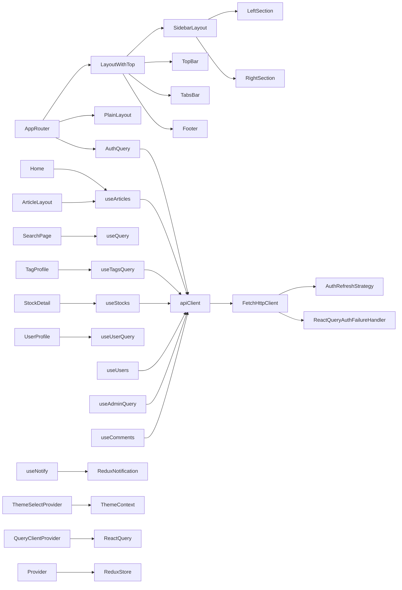
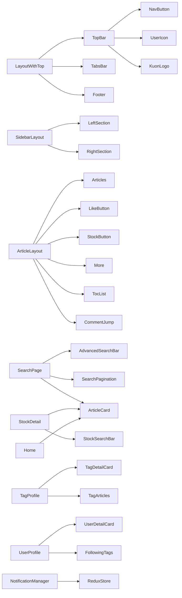

# システム概要

このプロジェクトはナレッジ共有アプリケーションです。

- フロントエンドは React 19、Vite、MUI、TanStack React Router、TanStack React Query を中心に構成されている。
- API 呼び出しは独自の `FetchHttpClient` をラップした `apiClient` と、外部認証用の `authClient` で行われる。
- 認証状態は `useAuthQuery` による `React Query` で管理され、通知は Redux ストア経由で扱われる。
- ページ単位で遅延ロードを採用し、ルート定義は `src/routes` に集約されている。

この設計書は、既存構成の責務を整理し、今後の共通化・Feature 単位整理・Hooks 整理・API 管理整理・型整理・Utility 整理・コンポーネント責務分離の土台とする。

---

# ディレクトリ構成

- `src/api/`
  - HTTP クライアントと認証関連の抽象化
  - `FetchHttpClient`、`CookieAuthRefreshStrategy`、`ReactQueryAuthFailureHandler` など

- `src/components/`
  - UI コンポーネント群
  - `common/`：共通 UI、ローディング、ナビボタン、タグ、通知など
  - `layouts/`：TopBar、TabsBar、SideSection、Footer、BottomBar などのページレイアウト
  - ドメイン別コンポーネント：`Article/`、`User/`、`Tag/`、`Stock/`、`Markdown/`、`Search/` 等

- `src/pages/`
  - ルート対応ページの配置
  - `Auth/`、`Home/`、`Articles/`、`Stock/`、`Tags/`、`User/`、`UserSettings/`、`Editor/`、`Drafts/`、`Trash/`、`Timeline/`、`Trends/`

- `src/routes/`
  - TanStack Router のルート定義とレイアウト構成
  - `__root.tsx`：レイアウト定義
  - 各ドメイン別ルート定義ファイル

- `src/hooks/`
  - データ取得と更新ロジックの自作 Hooks
  - `useAuth.ts`、`useArticles.ts`、`useUsers.ts`、`useTags.ts`、`useStocks.ts`、`useComments.ts` など
  - ユーティリティ Hooks：`useNotify`、`useTheme`、`useSlug`、`useLongPress`、`useKey`

- `src/store/`
  - Redux ストアの構成
  - 通知管理 `notificationSlice`

- `src/styles/`
  - `themes.ts`、`theme.ts`、CSS、admonitions

- `src/types/`
  - 型定義の拡張用フォルダー

- `src/utils/`
  - `queryClient/`、`errorHelpers/`、`uuid/`、`remark/`、`rehype/`

- ルートファイル
  - `src/main.tsx`：Provider 構成（Redux、React Query、Theme）
  - `src/router.tsx`：認証状態を待ってから RouterProvider を描画

---

# Feature一覧

- Auth / Login / 2FA / Register
- User / Profile / フォロー / フォロワー / フォロー中タグ
- User Settings / Account / Avatar / Profile / Security / 2FA / API Key / Uploaded Images
- Article / Knowledge Share / Article Detail / Liker / Markdown Rendering / Comments
- Drafts / Trash / Article 編集・作成
- Tag / Tag List / Tag Profile / Tag Edit / Tag Follow
- Stock / Bookmark / Stock List / Stock Detail / Stock Edit
- Search / 検索 / 検索結果
- Home / トレンド / タイムライン / 推薦記事
- Admin / 管理ユーザー・セキュリティ / IDP 管理
- Notification / Theme / Common Layout

---

# ページ一覧

## `/`

- 役割: ホーム画面、最新/おすすめ/トレンド記事の表示
- 使用API: `useArticles` / `/articles/recommends` / `/articles/trends`
- 使用Component: `Home`, `ArticleCard`, `ArticlesSkeleton`, `Link`

## `/trend`

- 役割: トレンド記事一覧表示
- 使用API: `useArticles` / `/articles/trends`
- 使用Component: `Trends`, `ArticleCard`, `ArticlesSkeleton`

## `/timeline`

- 役割: タイムライン記事表示
- 使用API: `useArticles` / おそらく `/articles/timeline` 系（実装から類推）
- 使用Component: `Timeline`, `ArticleCard`

## `/search`

- 役割: 検索 UI と検索結果表示
- 使用API: `apiClient.get('/articles', { q, page, limit })`
- 使用Component: `SearchPage`, `AdvancedSearchBar`, `SearchPagination`, `ArticleCard`, `ArticlesSkeleton`

## `/login`

- 役割: ログインフォーム
- 使用API: `apiClient.post('/login')`
- 使用Component: `Login`

## `/login/2fa`

- 役割: 二段階認証コード入力
- 使用API: `apiClient.post('/login/verify-2fa')`
- 使用Component: `Login2FA`

## `/register`

- 役割: アカウント登録
- 使用API: `fetch('/api/register')`（ページ内直接呼び出し）
- 使用Component: `Register`

## `/drafts/new`

- 役割: 新規記事作成
- 使用API: `useArticles.createArticle`, `/articles/create`
- 使用Component: `Editor/New`, `FastEditor` 系または `MarkdownEditor`

## `/drafts`

- 役割: 下書き一覧
- 使用API: `useArticles.userArticles` / `useArticles.trashArticles` など
- 使用Component: `Drafts`

## `/trash`

- 役割: ゴミ箱一覧・復元・完全削除
- 使用API: `/articles/trash/list`, `/articles/:id/restore`, `/articles/:id/hard`
- 使用Component: `Trash`

## `/$username/$articleId`

- 役割: 記事詳細表示
- 使用API: `queryClient.ensureQueryData([...], apiClient.get('/articles/:id'))`
- 使用Component: `ArticleLayout`, `Articles`, `Markdown`, `BottomUserCard`, `Comment`, `LikeButton`, `StockButton`, `More`, `TocList`, `CommentJump`

## `/$username/$articleId/liker`

- 役割: いいねしたユーザー一覧表示
- 使用API: `/articles/:id/likes`
- 使用Component: `ArticleLiker`

## `/$username`

- 役割: ユーザープロフィール親ページ
- 使用API: `useUsers.userQuery`, `/users/:username`
- 使用Component: `UserProfile`, `UserDetailCard`, `FollowingTags`, `Outlet`

## `/$username/follower`

- 役割: フォロワー一覧
- 使用API: `/users/:id/follower`
- 使用Component: `FollowerList`

## `/$username/following`

- 役割: フォロー中一覧
- 使用API: `/users/:id/follow`
- 使用Component: `FollowingList`

## `/$username/following-tags`

- 役割: フォロー中タグ一覧
- 使用API: `/users/:id/following_tags`
- 使用Component: `FollowingTagsPage`

## `/settings` 配下

- 役割: ユーザー設定ページの親
- 使用API: `/me`, 各設定 API
- 使用Component: `UserSettings`, `Account`, `AvatarUpload`, `PublicProfile`, `Security`, `TwoFASetting`, `APIKeySettings`, `UploadedImages`

## `/stocks`

- 役割: 自分のストックリスト管理
- 使用API: `useStocks` / `/stocks/mylists`, `/stocks/lists`, `/stocks/lists/:id`, `/stocks/lists/:id/articles` など
- 使用Component: `StockLayout`, `StockDetail`, `StockEditWrapper`, `StockListCard`, `StockSearchBar`

## `/stocks/new`

- 役割: 新規ストックリスト作成
- 使用API: `/stocks/lists`
- 使用Component: `StockEditWrapper`, `StockEditPages`

## `/stocks/$listId`

- 役割: ストックリスト詳細
- 使用API: `/stocks/lists/:listId`, `/stocks/alllists`
- 使用Component: `StockDetail`, `ArticleCard`

## `/stocks/$listId/edit`

- 役割: ストックリスト編集
- 使用API: `/stocks/lists/:listId`
- 使用Component: `StockEditWrapper`, `StockEditPages`

## `/stock-feed`

- 役割: 公開ストックリストのフィード
- 使用API: `/stocks/lists`
- 使用Component: `PublicStocksPage`, `StockListCard`

## `/tags`

- 役割: タグ一覧
- 使用API: `/tags`
- 使用Component: `TagList`

## `/tags/$slug`

- 役割: タグ詳細表示
- 使用API: `/tags/:slug`, `/articles`, `/tags/:slug/isFollowing`
- 使用Component: `TagProfile`, `TagDetailCard`, `TagArticles`

## `/tags/$slug/edit`

- 役割: タグ編集
- 使用API: `/tags`, `/tags/:slug/upload_avatar`
- 使用Component: `TagEdit`

## `/admin`

- 役割: 管理者トップページ
- 使用API: `/admin/settings/users`, `/admin/idp_settings`, `/admin/idp_list`
- 使用Component: `AdminIndex`, `Security`, `UserManagement`

## `/admin/security`

- 役割: 管理者セキュリティ設定
- 使用API: IDP 取得・更新
- 使用Component: `Security`

## `/admin/users`

- 役割: 管理者ユーザー管理
- 使用API: 管理者用ユーザー一覧・有効化
- 使用Component: `UserManagement`

---

# Component一覧

## `AppRouter`

- 責務: 認証状態を読み込み、ルーターを初期化して `RouterProvider` を描画する
- Props: なし
- State: なし
- 使用Hook: `useAuthQuery`
- 使用API: `/me`
- 子Component: `RouterProvider`, `NotificationManager`, `TanStackRouterDevtools`

## `TopBar`

- 責務: ナビゲーション、検索、認証ボタン表示
- Props: なし
- State: `searchValue`, `showSearch`
- 使用Hook: `useAuthQuery`, `useNavigate`, `useTheme`, `useMediaQuery`
- 使用API: なし（認証情報は `useAuthQuery` から取得）
- 子Component: `NavButton`, `KuonLogo`, `UserIcon`

## `TabsBar`

- 責務: 画面上部のタブ切り替え UI（ルーティングタブ）
- Props: なし
- State: なし
- 使用Hook: なし
- 使用API: なし
- 子Component: MUI タブ要素

## `LeftSection` / `RightSection`

- 責務: サイドバー用コンテナ。コンテンツを貼り付けるためのレイアウトを提供する。
- Props: `children`, `sticky`
- State: なし
- 使用Hook: なし
- 使用API: なし
- 子Component: 任意の子要素

## `Footer`

- 責務: フッターを表示する
- Props: なし
- State: なし
- 使用Hook: なし
- 使用API: なし
- 子Component: なし

## `ArticleLayout`

- 責務: 記事詳細ページのレイアウト管理、サイドバーアクション、コメント/目次表示
- Props: なし
- State: なし
- 使用Hook: `useArticles`, `articleRoute.useParams`
- 使用API: `/articles/:id`, `/articles/:id/like`, `/articles/:id/likes`, `/articles/:id/islike`, `/articles/:id/isowned`
- 子Component: `LeftSection`, `RightSection`, `BottomBar`, `LikeButton`, `StockButton`, `More`, `TocList`, `CommentJump`, `Articles`

## `Articles`

- 責務: 記事本文表示とメタ情報（著者、タグ、日付、コメント）
- Props: `article`, `isLoading`
- State: なし
- 使用Hook: なし
- 使用API: なし
- 子Component: `Markdown`, `BottomUserCard`, `Comment`, `TagChip`

## `SearchPage`

- 責務: 検索クエリの解釈、API 検索、結果リストの描画
- Props: なし
- State: なし
- 使用Hook: `useSearch`, `useQuery`
- 使用API: `/articles?q=&page=&limit=` via `apiClient.get`
- 子Component: `AdvancedSearchBar`, `SearchPagination`, `ArticleCard`, `ArticlesSkeleton`

## `StockDetail`

- 責務: ストックリスト詳細の取得・検索・ページング
- Props: なし
- State: なし
- 使用Hook: `useParams`, `useSearch`, `useStocks`
- 使用API: `/stocks/lists/:listId`, `/stocks/alllists`
- 子Component: `StockSearchBar`, `ArticleCard`, `Pagination`

## `TagProfile`

- 責務: タグ詳細表示と説明の展開、記事一覧表示
- Props: なし
- State: `isExpanded`
- 使用Hook: `useTagsQuery`, `useTheme`
- 使用API: `/tags/:slug`, `/tags/:slug/isFollowing`, `/articles` 関連
- 子Component: `TagDetailCard`, `TagArticles`

## `UserProfile`

- 責務: ユーザープロフィールページ全体のレイアウトと子ページ切り替え
- Props: なし
- State: なし
- 使用Hook: `useUserQuery`
- 使用API: `/users/:username`
- 子Component: `UserDetailCard`, `FollowingTags`, `Outlet`

## `NotificationManager`

- 責務: Redux 通知キューから通知を表示・削除する
- Props: なし
- State: なし
- 使用Hook: Redux `useSelector` / `useDispatch`（想定）
- 使用API: なし
- 子Component: 通知表示 UI

## `Loading` / `ArticlesSkeleton`

- 責務: ページやコンテンツのローディング表示
- Props: なし
- State: なし
- 使用Hook: なし
- 使用API: なし
- 子Component: なし

---

# Hook一覧

- `useAuthQuery`
  - 認証ユーザー取得、ログイン、ログアウト、2FA、ユーザー情報更新、APIキー、セッション管理、アバター管理、IDP 連携
- `useArticles`
  - 記事一覧、推薦記事、トレンド記事、記事詳細、いいね、下書き、ゴミ箱、画像アップロード、ロールバック、削除、マープ取得
- `useUsers`
  - ユーザー情報取得、フォロー状態、フォロー/フォロワーリスト、ピックアップ記事、ランキング
- `useTagsQuery`
  - タグ一覧、タグ詳細、タグ作成/更新、フォロー中タグ、タグフォロー、画像アップロード
- `useStocks`
  - 自分のストックリスト、公開ストックリスト、ストック詳細、記事保存トグル、リスト CRUD、いいね、デフォルト切り替え
- `useAdminQuery`
  - 管理者ユーザー一覧、IDP 設定、IDP 有効化/無効化、ユーザー有効化切り替え
- `useComments`
  - コメント一覧、ツリー化、投稿、削除、いいね、コメント詳細取得
- `useNotify`
  - Redux 通知の発行と成功/エラー通知のラップ
- `useThemeContext` / `ThemeSelectProvider`
  - テーマ選択、カスタムカラー、ローカルストレージ保持
- `useSlug` / `useLongPress` / `useKey`
  - 汎用フック（URL slug、長押し、キー操作など）

---

# Context一覧

- `MyRouterContext`
  - `src/routes/__root.tsx` で定義されるルータコンテキスト。`user` を保持し、ルートの `beforeLoad` で認証判定に利用される。
- `ThemeContext`
  - `src/hooks/useTheme/useTheme.tsx` によるテーマ選択コンテキスト。`ThemeSelectProvider` で `ThemeProvider` を組み合わせる。
- Redux 通知ストア
  - `src/store/feature/notificationSlice.ts` で通知キューを管理。
- React Query
  - `src/utils/queryClient/index.ts` の `QueryClient` を `QueryClientProvider` で提供。

---

# API呼び出し一覧

## API クライアント

- `src/api/client.ts`
  - 共通 API 用 `apiClient`
  - baseURL: `/api`
  - `credentials: include`
  - `authFailureHandler`, `authRefreshStrategy` を組み込み
- `src/api/authClient.ts`
  - 外部認証用 `authClient`
  - baseURL: `/auth`

## 認証 / ユーザー

- `GET /me`
- `POST /login`
- `POST /login/verify-2fa`
- `POST /logout`
- `POST /logout/all`
- `POST /logout/device/:sessionId`
- `GET /users/settings/uploaded_images`
- `PUT /users/update/info`
- `PUT /users/update/username`
- `GET /idp/active`
- `GET /users/settings/idpinfo`
- `POST /avatar/select`
- `DELETE /:providerName/unlink`
- `POST /users/settings/upload_avatar`
- `GET /devices`
- `GET /users/settings/api-keys`
- `POST /users/settings/api-keys`
- `DELETE /users/settings/api-keys/:apiKeyId`
- `GET /users/:username`
- `GET /users/:id/isfollowing`
- `GET /users/:id/follow`
- `GET /users/:id/follower`
- `GET /users/:id/comments`
- `GET /users/:id/articles`
- `POST /users/follow`
- `GET /users/:userId/pickup`
- `POST /users/pickup/create`
- `POST /users/pickup/delete`
- `GET /users/tags/me`
- `GET /users/:userId/following_tags`
- `GET /users/ranking/all`

## 記事 / ナレッジ

- `GET /articles`
- `GET /articles/:id`
- `GET /articles/:id/likes`
- `GET /articles/:id/islike`
- `POST /articles/:id/like`
- `GET /articles/:id/isowned`
- `POST /articles/create`
- `PATCH /articles/:id/edit`
- `GET /articles/me`
- `GET /articles/trash/list`
- `POST /articles/:id/restore`
- `DELETE /articles/:id`
- `DELETE /articles/:id/hard`
- `POST /articles/:id/rollback`
- `GET /articles/recommends`
- `GET /articles/trends`
- `GET /articles/marp/:id`
- `POST /articles/upload`
- `POST /articles/:articleId/comments`
- `DELETE /articles/:articleId/comments/:commentId`
- `GET /articles/:articleId/comments`
- `GET /articles/:articleId/comments/:commentId/likes`
- `GET /articles/:articleId/comments/:commentId/islike`
- `POST /articles/:articleId/comments/:commentId/like`

## タグ

- `GET /tags`
- `GET /tags/:slug`
- `POST /tags`
- `GET /tags/:slug/isFollowing`
- `POST /tags/:slug/follow`
- `POST /tags/:slug/upload_avatar`

## ストック

- `GET /stocks/mylists`
- `GET /stocks/lists`
- `GET /stocks/lists/:listId`
- `GET /stocks/alllists`
- `POST /stocks/lists/:listId/articles`
- `POST /stocks/lists`
- `PATCH /stocks/lists/:listId`
- `DELETE /stocks/lists/:listId`
- `POST /stocks/default/articles`
- `GET /stocks/lists/:listId/islike`
- `POST /stocks/lists/:listId/like`

## 管理者

- `GET /admin/settings/users`
- `GET /admin/idp_settings/:provider_name`
- `GET /admin/idp_list`
- `POST /admin/idp_settings`
- `POST /admin/idp_settings/toggle_active/:provider_name`
- `POST /admin/settings/users/toggle_active/:userId`
- `DELETE /admin/idp_settings/:target_name`
- `GET /admin/idp_settings/discovery`

---

# Utility一覧

- `src/api/FetchHttpClient/FetchHttpClient.ts`
  - `fetch` ベースの汎用 HTTP クライアント
  - 401 自動リフレッシュ、再試行、エラーパース
- `src/api/FetchHttpClient/AuthFailureHandler.ts`
  - 認証失敗時の全体ハンドリング
- `src/api/CookieAuthRefreshStrategy.ts`
  - Cookie ベースのトークンリフレッシュ戦略
- `src/api/ReactQueryAuthFailureHandler.ts`
  - React Query と連携した認証失敗処理
- `src/utils/queryClient/index.ts`
  - React Query のグローバル設定
- `src/utils/errorHelpers/index.ts`
  - HTTP エラー判定 / 状態判定ユーティリティ
- `src/utils/uuid/index.ts`
  - UUID 生成 / 検証
- `src/hooks/useTheme/useTheme.tsx`
  - テーマ選択とカスタムカラー生成
- `src/styles/themes.ts`
  - テーマ定義
- `src/styles/admonitions.css`
  - Markdown 表示スタイル
- `src/remark/` / `src/rehype/`
  - Markdown 解析/レンダリング補助

---

# 型一覧

- `AuthUser`
- `ActiveIdp`
- `UserApiKey`, `CreateApiKeyResponse`
- `UserIdentity`, `UserAvatar`, `UserIdpinfo`
- `SessionDevice`
- `Article`, `Articles`, `UserArticles`, `LikeUser`, `LikeUserResponse`, `IsLikedResponse`, `isOwnedResponse`
- `CreateArticleData`, `EditArticleData`
- `Tag`, `Tags`, `UpsertTagData`, `FollowingTags`, `UserFollowingTags`
- `StockList`, `StockListDetail`
- `Comment`, `CommentUser`
- `UUID`
- `ThemeContextProps`, `ThemeSelectProviderProps`

---

# データフロー

---

# 画面遷移

```mermaid
graph TD
  Home[/"/" Home/] --> Trend[/"/trend"/]
  Home --> Timeline[/"/timeline"/]
  Home --> Search[/"/search"/]
  Tags[/"/tags"/] --> TagProfile[/"/tags/$slug"/]
  TagProfile --> TagEdit[/"/tags/$slug/edit"/]
  Stocks[/"/stocks"/] --> StocksNew[/"/stocks/new"/]
  Stocks[/"/stocks"/] --> StocksDetails[/"/stocks/$listId"/]
  StocksDetails --> StocksEdit[/"/stocks/$listId/edit"/]
  PublicStockFeed[/"/stock-feed"/]
  UserRoot[/"/$username"/] --> UserFollower[/"/$username/follower"/]
  UserRoot --> UserFollowing[/"/$username/following"/]
  UserRoot --> UserFollowingTags[/"/$username/following-tags"/]
  UserRoot --> UserStock[/"/$username/stocks/$listId"/]
  UserRoot --> Settings[/"/settings"/]
  Settings --> Account[/"/settings/account"/]
  Settings --> CustomImage[/"/settings/account/custom-image"/]
  Settings --> PublicProfile[/"/settings/profile"/]
  Settings --> Security[/"/settings/security"/]
  Settings --> TwoFA[/"/settings/setup2fa"/]
  Settings --> ApiKey[/"/settings/api-key-settings"/]
  Settings --> UploadedImages[/"/settings/uploaded-images"/]
  ArticleRoot[/"/$username/$articleId"/] --> ArticleIndex[/"/"/]
  ArticleRoot --> ArticleLiker[/"/liker"/]
  AuthRoot[/"/login"/] --> Login2FA[/"/login/2fa"/]
  AuthRoot --> Register[/"/register"/]
  Drafts[/"/drafts"/] --> DraftNew[/"/drafts/new"/]
  Trash[/"/trash"/]
  AdminRoot[/"/admin"/] --> AdminSecurity[/"/admin/security"/]
  AdminRoot --> AdminUsers[/"/admin/users"/]
```

---

# 依存関係

---

# 共通化候補

- Button / `NavButton` / MUI ボタン
- Modal / Dialog / `More` 相当の拡張
- Form / 各種設定フォーム
- Input / 検索バー / フォーム入力
- Card / `ArticleCard`, `TagCard`, `StockListCard`, `UserCard`
- List / フォロワー・フォロー・タグ・ストックリスト
- Pagination / 検索・ストック一覧・記事一覧
- Loading / `Loading`, `ArticlesSkeleton`, `LoadingSkelton`
- Error 表示 / ページレベルの `isError` 処理
- Badge / フォロー数・いいね数・更新ステータス
- Section / `LeftSection`, `RightSection`, `BottomBar`
- Layout / `layoutWithTopRoute`, `sidebarLayoutRoute`, `plainLayoutRoute`
- Notification / Redux 通知
- Theme / `ThemeSelectProvider`

---

# 責務が大きいComponent

1. `useAuthQuery`
   - 認証とユーザー情報取得、2FA、セッション、APIキー、アバター切替など複合責務が集中
2. `useArticles`
   - 記事一覧、詳細、いいね、下書き、ゴミ箱、画像アップロード、コメント関連まで含む大規模 Hook
3. `useStocks`
   - 複数 API と CRUD/トグル/ページングを内包している
4. `useTagsQuery`
   - タグ一覧、詳細、フォロー、アップサート、画像アップロードを一つに集約
5. `useUsers`
   - フォロー状態、プロフィール、ピックアップ、ランキングを横断的に処理
6. `ArticleLayout`
   - 記事詳細ページで UI とアクションが混在しやすい
7. `SearchPage`
   - 検索クエリ管理、検索結果、ページングを同一ページで処理
8. `TopBar`
   - 認証判定、検索 UI、管理リンクを混在
9. `UserSettings` 系ページ
   - `/settings` のネスト構造と認証前提条件が複雑
10. `NotificationManager`

- UI 表示と Redux 依存を跨ぐ

---

# リファクタリング候補

## Critical

- `useAuthQuery` の分割
  - 認証状態取得と `login`/`logout`/2FA/設定更新を分離し、責務を明確化する。
- `useArticles` の分割
  - `useArticleDetail`、`useArticleList`、`useArticleMutations`、`useTrashArticles` 等に分割する。
- API レイヤーの整理
  - `apiClient`/`authClient` をドメイン別 API モジュールに分割し、エンドポイントの重複呼び出しを整理する。
- ルートとページの Feature 単位再編成
  - `src/pages/Tags`、`src/pages/Stock`、`src/pages/UserSettings` などを feature ディレクトリに再構築する。

## High

- UI 共通コンポーネント抽出
  - `Button`, `Input`, `Card`, `List`, `Pagination`, `Loading`, `Error` などを `shared` または `components/common` に集約
- `TopBar` の責務整理
  - 認証情報表示、検索、管理リンクを小さなサブコンポーネントへ分割
- `ArticleLayout` の責務分離
  - サイドバー、本文、ボトムバーをより明確に分離し、データ取得ロジックを hook に移す
- `UserSettings` ネストの整理
  - 設定項目をルート構造に合わせて分割し、`beforeLoad` ロジックを共通化

## Medium

- `useTagsQuery` / `useStocks` / `useUsers` の共通クエリ整理
  - 同じ `apiClient` 呼び出しや `queryClient.invalidateQueries` パターンを共通化
- 通知とエラーハンドリングの統一
  - `useNotify` の適用範囲を明確化し、ページ固有エラー表示を整理
- レイアウトプレースホルダの改善
  - `LeftSection` / `RightSection` は現在プレースホルダ要素も含むため、明確なサイドバーコンポーネントに置き換え

## Low

- `ThemeSelectProvider` の整理
  - テーマ設定を `shared/theme` に分離し、色設定ロジックを簡潔化
- `queryClient` のデフォルトオプション調整
  - 機能要件に応じたキャッシュ戦略を再評価
- `src/types` の強化
  - ドメイン別型定義を `types/feature` などに整理し、個別ファイルを削減
- `src/utils/remark`, `src/utils/rehype` の再確認
  - Markdown 処理を必要な機能だけに限定し、不要な依存を削減

---

# 優先的なリファクタリング方針

1. `useAuthQuery` および認証周りの責務分離
2. `useArticles` の機能分割とコメント / いいね / trash 処理の整理
3. ルート / ページ / feature 構成の再編
4. 共通 UI の `shared` 収束
5. `apiClient` と `FetchHttpClient` のドメイン別 API 抽象化
6. `useTagsQuery` / `useStocks` / `useUsers` の共通クエリ整理
7. レイアウトコンポーネントの責務明確化
8. エラー/ローディング表示の統一
9. 型定義の整理
10. テーマ/通知/ユーティリティの再配置
